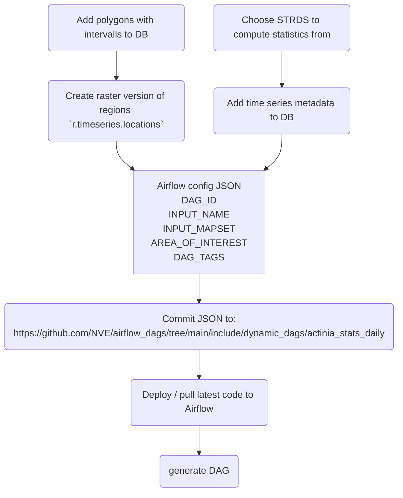

```mermaid
  graph TD;
      A(Add polygons with intervalls to DB)-->B;
      B(Create raster version of regions `r.timeseries.locations`)-->E[Airflow config JSON<br/>DAG_ID<br/>INPUT_NAME<br/>INPUT_MAPSET<br/>AREA_OF_INTEREST<br/>DAG_TAGS];
      D(Choose STRDS to compute statistics from)-->C;
      C(Add time series metadata to DB)-->E;
      E-->F(Commit JSON to:<br/>https://github.com/NVE/airflow_dags/tree/main/include/dynamic_dags/actinia_stats_daily);
      F-->G(Deploy / pull latest code to Airflow)
      G-->H(generate DAG);
      click B "https://github.com/NVE/actinia_modules_nve/tree/main/src/raster/r.timeseries.locations" "r.timeseries.locations --help" _blank
      click F "https://github.com/NVE/airflow_dags/tree/main/include/dynamic_dags/actinia_stats_daily" "git commit" _blank
```
