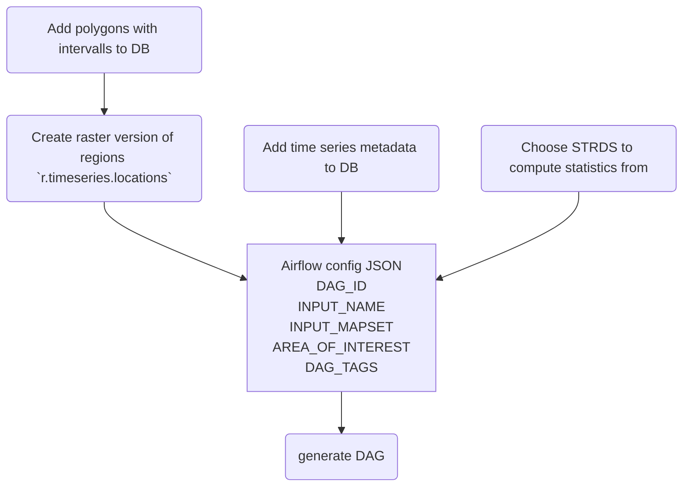

```mermaid
  graph TD;
      A(Add polygons with intervalls to DB)-->B;
      B(Create raster version of regions `r.timeseries.locations`)-->E[Airflow config JSON<br/>DAG_ID<br/>INPUT_NAME<br/>INPUT_MAPSET<br/>AREA_OF_INTEREST<br/>DAG_TAGS];
      C(Add time series metadata to DB)-->E;
      D(Choose STRDS to compute statistics from)-->E;
      E-->F(generate DAG);
```
